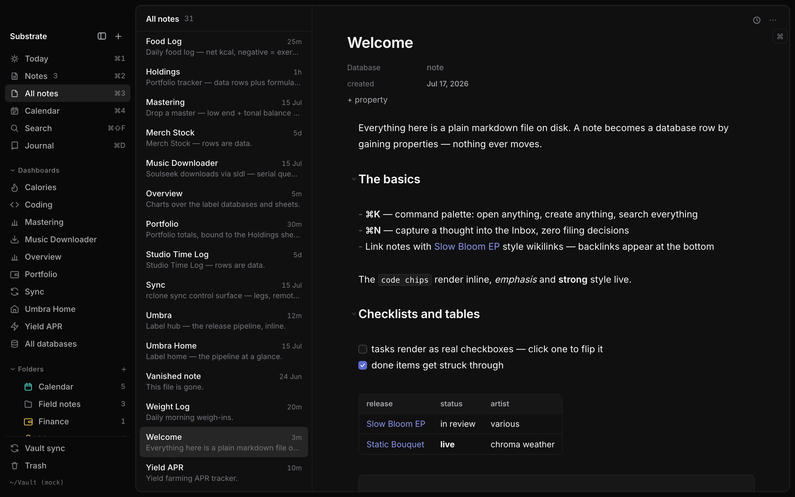
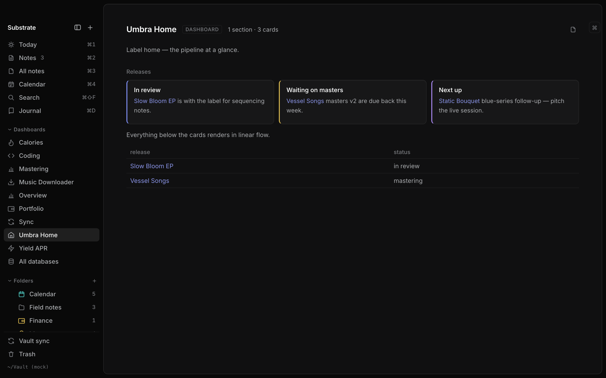

# Substrate

Local-first notes, databases, and dashboards for macOS. A cross of Obsidian
(plain markdown files you own), Notion (properties + database views), and
Linear (speed, keyboard-first, command palette). The layer everything grows on.




## Model

- Every note is a markdown file in a **vault** — one folder on disk
  (`~/Vault` by default, override with `VAULT_DIR`). The files are the only
  source of truth: edit them in any other app and Substrate picks up the
  change; delete Substrate and your notes are still just markdown.
- Frontmatter properties make a note a database row. A "database" in the
  sidebar is simply the set of notes sharing a `type` property (`type: contact`
  → the Contacts database), viewable as table, board, list, or calendar.
  Nothing ever moves to join a view.
- `[[Wikilinks]]` connect notes; backlinks render at the bottom of each note.
  ⌘-clicking a link to a note that doesn't exist yet creates it.
- Capture is zero-decision: ⌘N drops a new note into `Inbox/`, and ⌥Space
  captures from any app via a floating window (Substrate lives in the menu
  bar). Untyped notes surface in the Notes view, recency-sorted; giving one a
  `type` files it into its database. The hotkey and close-to-tray behavior
  live in the vault's `Settings.md`.
- Sheets are formula tables in plain text: a `type: sheet` note holds CSV data
  and named column formulas (`SUM`, `SUMIF`, …), and dashboards bind stat
  cards, charts, and live database views to the results. See
  [docs/sheets-spec.md](docs/sheets-spec.md) and
  [docs/dashboards.md](docs/dashboards.md).



## Keys

⌘/ (or ?) shows the full shortcut sheet in-app. The core set:

| Key | Action |
| --- | --- |
| ⌘K | Command palette — open anything, run anything |
| ⌘⇧F | Full-text search |
| ⌘N | New note to Inbox (in a database view: new entry) |
| ⌥Space | Global capture from any app (floating window → Inbox) |
| ⌘D | Open today's journal |
| ⌘1–⌘4 | Today · Notes · All notes · Calendar |
| ⌘5–⌘9 | Pinned views, in sidebar order |
| ↑↓ / j k | Move list selection · ↩ opens |
| ⌘\ | Hide or show the sidebar |
| ⌫ / ⌘[ | Walk back through view history |
| ⌘-click | Follow a wikilink (creates the note if missing) |

## Try it

Prerequisites: [Node.js](https://nodejs.org) ≥ 20, [Rust](https://rustup.rs)
(stable), and Xcode Command Line Tools (`xcode-select --install`). First build
compiles the Rust engine — expect a few minutes.

```sh
git clone <this repo> && cd substrate
npm install
cp -r examples/vault ~/SubstrateDemo
VAULT_DIR=~/SubstrateDemo npm run tauri dev
```

That opens the app on a demo vault with working examples of notes, databases,
sheets, and every dashboard kind. (Copy the example vault first as shown — the
app initializes version history inside the vault it opens, which you don't
want inside this repo.) Without `VAULT_DIR` the app uses `~/Vault`, creating
it if needed.

`npm run tauri build` produces a distributable `Substrate.app` bundle.

## Stack

Tauri v2 — a Rust engine (file scan, frontmatter parsing, SQLite FTS5 search,
backlink index, fs watcher, git-based note history) under a React/TypeScript
front end (CodeMirror 6 live-rendered markdown). The in-memory index is
rebuilt on file change; the vault on disk stays the only source of truth.

For UI work, `npm run dev` serves the front end in a plain browser against a
deterministic mock backend — no Tauri, no Rust build, no real vault.

## Dev

```sh
npm run tauri dev            # full app, dev window
npm run dev                  # front end only, mock backend, plain browser
npx tsc --noEmit             # typecheck
npm test                     # node test suite (lib + scripts)
cd src-tauri && cargo test   # Rust engine tests
npm run e2e                  # Playwright smoke over the mock backend
```

Docs: [dashboards](docs/dashboards.md) · [sheets](docs/sheets-spec.md) ·
[vault format on disk](docs/vault-format.md).

## Status

Personal project, built for one person's daily use and shared as-is:
macOS-first (an iOS build exists but is not distributed), no releases, no
support promises. Issues and ideas are welcome; expect the roadmap to follow
its owner's needs.

